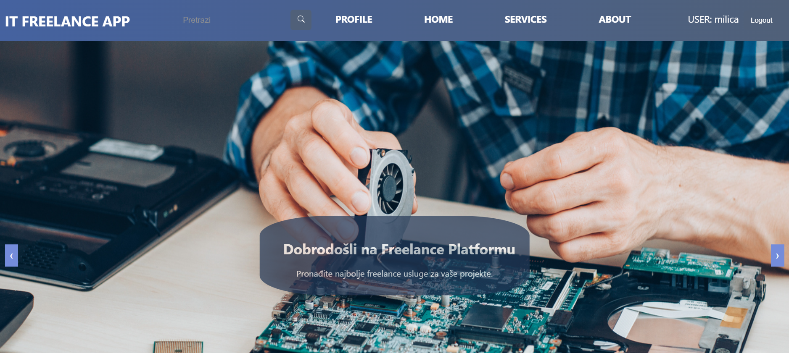
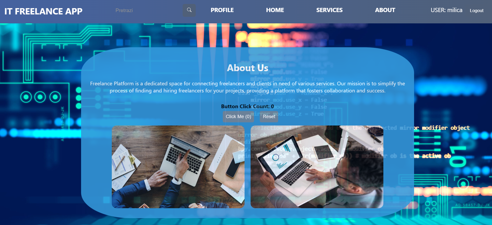

# IT Freelance React Application

Welcome to the IT Freelance React Application, a powerful platform designed to connect users with freelance services in the IT industry. With a focus on user experience and functionality, this application offers a range of features to enhance user engagement and satisfaction.

## Features:

### User Authentication:
- Users can securely log in to the application, ensuring access control and data privacy.

### Service Exploration:
- Explore detailed information about the application and its offerings, providing users with insights into available services.

### Service Listings:
- View a comprehensive list of currently available services, enabling users to browse and select services that meet their requirements.

### Service Rating:
- Users can rate services on a scale of 1 to 5, offering valuable feedback to service providers and enhancing overall service quality.

### User Profile Management:
- Access and manage user profiles, including personal information and profile pictures, providing users with a personalized experience.

### Logout Functionality:
- Seamlessly log out of the application with the click of a button, ensuring a smooth user experience.

### Service Search:
- Utilize the built-in search functionality to find services based on the name of the service provider offering them, enhancing user convenience and efficiency.

## Getting Started:

To deploy and run the IT Freelance React Application locally, follow these steps:

1. Clone the project repository to your local machine.
2. Install the necessary dependencies using npm.
3. Start the development server using the appropriate npm command.
5. Access the application through your preferred web browser and explore its features and functionalities (localhost:3000).

## Screenshots of The Application:
### Login page

  

### Homepage
-On the homepage user can view all ports that are in the database system, search them by name and sort them.
 

  

 

### Services

  

 

### About

  

 

